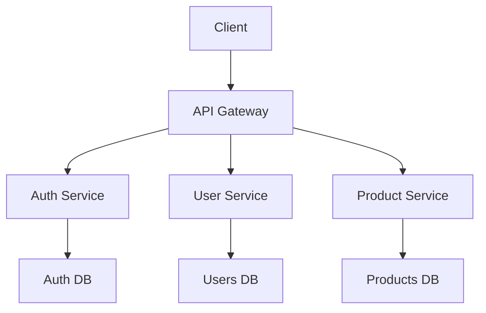
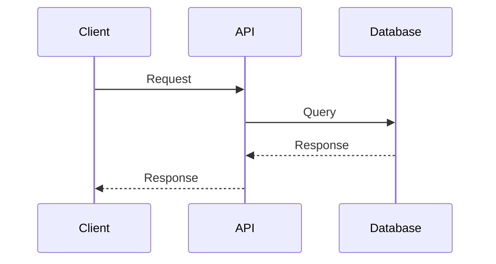

# Technical Architecture Guide 🏗️

This document details the technical architecture of the system, its components, and design patterns.

## Core Design Patterns 🧩

### 1. Atomic Design (Technical Implementation)

```typescript
// Directory structure
src/
  ├── components/
  │   ├── atoms/          // Base components
  │   │   ├── Button.tsx
  │   │   ├── Input.tsx
  │   │   └── Typography.tsx
  │   ├── molecules/      // Composite components
  │   │   ├── SearchBar.tsx
  │   │   └── FormField.tsx
  │   ├── organisms/      // Complex components
  │   │   ├── Header.tsx
  │   │   └── ProductCard.tsx
  │   └── templates/      // Layout templates
  │       ├── Dashboard.tsx
  │       └── AuthLayout.tsx
```

### 2. Service Pattern

```typescript
// Implementation example
interface IUserService {
    getUser(id: string): Promise<User>;
    updateUser(user: User): Promise<void>;
    deleteUser(id: string): Promise<void>;
}

class UserService implements IUserService {
    private apiClient: ApiClient;

    constructor(apiClient: ApiClient) {
        this.apiClient = apiClient;
    }

    async getUser(id: string): Promise<User> {
        return this.apiClient.get(`/users/${id}`);
    }
    // ... other methods
}
```

## State Architecture 🎯

### 1. Global State Management

```typescript
// store/index.ts
import { create } from 'zustand';

interface AppState {
    user: User | null;
    theme: 'light' | 'dark';
    setUser: (user: User) => void;
    setTheme: (theme: 'light' | 'dark') => void;
}

export const useStore = create<AppState>(set => ({
    user: null,
    theme: 'light',
    setUser: user => set({ user }),
    setTheme: theme => set({ theme }),
}));
```

### 2. Caching and Persistence

```typescript
// utils/cache.ts
import { LRUCache } from 'lru-cache';

const cache = new LRUCache({
    max: 500,
    ttl: 1000 * 60 * 5, // 5 minutes
});

export const cacheManager = {
    get: <T>(key: string): T | undefined => cache.get(key),
    set: <T>(key: string, value: T): void => cache.set(key, value),
    delete: (key: string): void => cache.delete(key),
};
```

## Performance Patterns ⚡

### 1. Lazy Loading

```typescript
// pages/dashboard.tsx
import dynamic from 'next/dynamic';

const DashboardChart = dynamic(
  () => import('../components/DashboardChart'),
  {
    loading: () => <LoadingSpinner />,
    ssr: false
  }
);
```

### 2. Code Splitting

```typescript
// webpack.config.js
module.exports = {
    optimization: {
        splitChunks: {
            chunks: 'all',
            maxSize: 244000,
        },
    },
};
```

## Security 🔒

### 1. Authentication and Authorization

```typescript
// middleware/auth.ts
import { NextResponse } from 'next/server';
import type { NextRequest } from 'next/server';

export function middleware(request: NextRequest) {
    const token = request.cookies.get('auth-token');

    if (!token && !request.nextUrl.pathname.startsWith('/auth')) {
        return NextResponse.redirect(new URL('/auth/login', request.url));
    }

    return NextResponse.next();
}
```

### 2. Data Sanitization

```typescript
// utils/sanitize.ts
import DOMPurify from 'dompurify';

export const sanitizeInput = (input: string): string => {
    return DOMPurify.sanitize(input, {
        ALLOWED_TAGS: ['b', 'i', 'em', 'strong'],
        ALLOWED_ATTR: [],
    });
};
```

## Monitoring and Logging 📊

### 1. Logging Implementation

```typescript
// utils/logger.ts
import winston from 'winston';

const logger = winston.createLogger({
    level: 'info',
    format: winston.format.json(),
    transports: [
        new winston.transports.File({ filename: 'error.log', level: 'error' }),
        new winston.transports.File({ filename: 'combined.log' }),
    ],
});

if (process.env.NODE_ENV !== 'production') {
    logger.add(
        new winston.transports.Console({
            format: winston.format.simple(),
        })
    );
}
```

### 2. Performance Metrics

```typescript
// utils/metrics.ts
import { metrics } from '@opentelemetry/api';

const meter = metrics.getMeter('app-metrics');

const requestCounter = meter.createCounter('http_requests_total', {
    description: 'Total number of HTTP requests',
});

export const trackRequest = () => {
    requestCounter.add(1);
};
```

## Architecture Diagrams 📐

### Component Diagram



### Data Flow Diagram



## Scalability Considerations 📈

### 1. Caching Strategy

- Multi-level caching (CDN, Redis, Memory)
- Event-based cache invalidation
- Dynamic TTLs based on data type

### 2. Load Balancing

- Weighted round-robin
- Sticky sessions when needed
- Automatic health checks

### 3. Database

- Horizontal sharding
- Read replicas
- Optimized indexes
- Date-based partitioning

## Implementation Guides 🛠️

### 1. New Components

```bash
# Component creation script
npm run create:component ComponentName --type=atom|molecule|organism
```

### 2. New Services

```bash
# Service creation script
npm run create:service ServiceName --type=api|business|data
```

## Technical References 📚

- [Next.js Documentation](https://nextjs.org/docs)
- [TypeScript Guide](https://www.typescriptlang.org/docs/)
- [Design Patterns](https://refactoring.guru/design-patterns)
- [Performance Best Practices](https://web.dev/vitals/)
