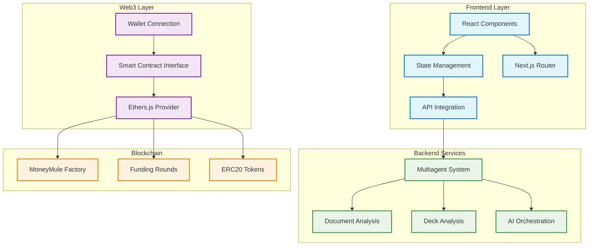
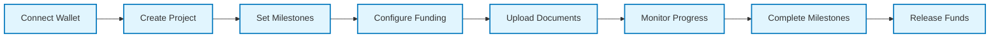
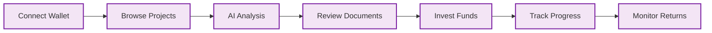

# MoneyMule Frontend 🌐


A modern web application for MoneyMule's milestone-based funding platform and investor tools. Built with Next.js, React, and Web3 integration for seamless blockchain interactions.

## 🏗️ MoneyMule Ecosystem

| Repository                                                                | Description                                         | Status    |
| ------------------------------------------------------------------------- | --------------------------------------------------- | --------- |
| **[Frontend](https://github.com/TomasDmArg/money-mule)**                  | Next.js web application with React & Tailwind CSS   | ✅ Active |
| **[Backend](https://github.com/TomasDmArg/money-mule-backend)**           | AI Multiagent system for deck and document analysis | ✅ Active |
| **[Smart Contracts](https://github.com/TomasDmArg/money-mule-contracts)** | Solidity contracts with Hardhat & TypeScript        | ✅ Active |

## 🌟 Overview

MoneyMule Frontend provides an intuitive interface for AI-powered investor tools and project analysis platform. The application combines intelligent investment analysis with advanced document processing, enabling investors to make data-driven decisions through comprehensive AI-powered pitch deck and document analysis.

## 🏗️ Architecture



## ✨ Key Features

### 🤖 **AI-Powered Investment Tools**

- **📊 Market Analysis**: AI-driven market trend analysis and insights
- **💡 Investment Recommendations**: Personalized investment suggestions based on user profile
- **🎯 Risk Assessment**: Intelligent risk analysis for funding opportunities
- **📈 Performance Prediction**: ML-powered project success probability models
- **🔍 Due Diligence**: Automated project evaluation and scoring
- **📊 Portfolio Optimization**: AI-assisted portfolio balancing and diversification

### 🎯 **Project Management**

- **📊 Dashboard**: Comprehensive project overview with funding progress
- **🎨 Project Creation**: Intuitive form for setting up funding rounds
- **📈 Analytics**: Real-time funding metrics and milestone tracking
- **🎯 Milestone Management**: Visual milestone timeline and progress tracking

### 💰 **Investment Interface**

- **🔍 Project Discovery**: AI-enhanced project browsing with smart filtering
- **💎 Investment Flow**: Seamless investment process with wallet integration
- **📊 Portfolio**: Track investments and returns across projects with AI insights
- **🔄 Withdrawal**: Easy withdrawal process for uncommitted funds
- **🤖 Smart Alerts**: AI-powered notifications for investment opportunities

### 📄 **Document Analysis**

- **🔍 Pitch Deck Analysis**: AI-powered pitch deck evaluation and scoring
- **📊 Document Processing**: Automated document analysis and insights
- **🎯 Content Extraction**: Intelligent data extraction from documents
- **📈 Comparative Analysis**: AI-driven comparison between projects

### 🔐 **Web3 Integration**

- **🦊 Wallet Connect**: Support for MetaMask and other Web3 wallets
- **🔄 Smart Contract Interaction**: Direct blockchain interactions
- **🌐 Network Support**: Saga Chainlet integration
- **⚡ Transaction Management**: Real-time transaction status and history

## 🎨 Design System

### **UI Components**

- **🧩 shadcn/ui**: Beautiful, accessible component library
- **🎭 HugeIcons**: Comprehensive icon set
- **🌊 Framer Motion**: Smooth animations and transitions
- **🎨 Tailwind CSS**: Utility-first styling approach
- **🤖 AI Components**: Custom AI-powered interface elements

### **User Experience**

- **📱 Responsive Design**: Mobile-first approach with seamless desktop experience
- **⚡ Performance**: Optimized loading and rendering
- **🎯 Accessibility**: WCAG compliant with keyboard navigation
- **🌙 Dark Mode**: Built-in theme switching
- **🤖 Intelligent UX**: AI-powered user experience optimization

## 🚀 Quick Start

### **Prerequisites**

- Node.js 18+ or Bun
- Web3 wallet (MetaMask recommended)
- Access to Saga Chainlet network

### **Installation**

```bash
# Clone the repository
git clone https://github.com/TomasDmArg/money-mule.git
cd money-mule

# Install dependencies
bun install

# Configure environment
cp .env.example .env.local
```

### **Environment Setup**

```env
# API Configuration
NEXT_PUBLIC_API_URL=https://backend.moneymule.xyz

# Smart Contract Addresses
NEXT_PUBLIC_FACTORY_ADDRESS=0xa1820208Dff37B39a8a324e82E3449283e21703b
NEXT_PUBLIC_USDC_ADDRESS=0xA2bE65F0Bfb810eF7B17807F3cd10D428f989A4a

# Network Configuration
NEXT_PUBLIC_CHAIN_ID=2751721147387000
NEXT_PUBLIC_RPC_URL=https://moneymule-2751721147387000-1.jsonrpc.sagarpc.io
NEXT_PUBLIC_EXPLORER_URL=https://moneymule-2751721147387000-1.sagaexplorer.io
```

### **Development**

```bash
# Start development server
bun run dev

# Build for production
bun run build

# Start production server
bun run start
```

## 🧪 Testing

### **Test Suite**

```bash
# Run all tests
bun run test

# Run tests with coverage
bun run test:coverage

# Run tests in watch mode
bun run test:watch

# Run E2E tests
bun run test:e2e
```

### **Test Coverage**

- ✅ Component unit tests
- ✅ Web3 integration tests
- ✅ API integration tests
- ✅ User workflow E2E tests
- ✅ Accessibility tests
- ✅ Performance tests

## 🐳 Docker Deployment

### **Development**

```bash
# Build development image
docker build -t moneymule-frontend:dev .

# Run development container
docker run -p 3000:3000 moneymule-frontend:dev
```

### **Production**

```bash
# Build production image
docker build -t moneymule-frontend:prod --target production .

# Run production container
docker run -p 3000:3000 moneymule-frontend:prod
```

## 📱 User Flows

### **Project Founder Flow**



### **Investor Flow**



## 🎯 Core Features

### **Dashboard**

- **📊 Overview**: Project statistics and funding progress
- **🎯 Milestones**: Visual timeline with completion status
- **💰 Financial**: Investment tracking and fund management
- **📈 Analytics**: Performance metrics and insights

### **Project Creation**

- **📝 Form Wizard**: Step-by-step project setup
- **🎯 Milestone Builder**: Interactive milestone configuration
- **💰 Funding Setup**: Target amount and token selection
- **📄 Document Upload**: Pitch deck and document management

### **Investment Interface**

- **🔍 Project Browser**: AI-enhanced filter and search functionality
- **💎 Investment Calculator**: Real-time investment calculations with AI insights
- **📊 Portfolio View**: Investment tracking and management with AI analytics
- **🔄 Transaction History**: Complete transaction log with pattern analysis
- **🤖 AI Recommendations**: Personalized investment suggestions

### **AI Analytics Dashboard**

- **📊 Market Intelligence**: Real-time market analysis and trends
- **🎯 Investment Insights**: AI-powered investment recommendations
- **📈 Performance Metrics**: Predictive analytics for project success
- **🔍 Risk Analysis**: Comprehensive risk assessment tools
- **💡 Smart Alerts**: AI-generated investment opportunity alerts

### **Document Analysis Center**

- **📄 Pitch Deck Analyzer**: AI-powered pitch deck evaluation
- **📊 Document Insights**: Automated document analysis and scoring
- **🎯 Content Intelligence**: Smart data extraction and categorization
- **📈 Comparative Reports**: AI-driven project comparison tools

## 🛠️ Technology Stack

### **Frontend Framework**

- **⚛️ Next.js 14**: React framework with App Router
- **🎨 React 18**: Component library with hooks
- **📝 TypeScript**: Type safety and developer experience
- **🎯 Tailwind CSS**: Utility-first styling

### **Web3 Integration**

- **🔗 Ethers.js v6**: Ethereum library
- **🦊 Wallet Connect**: Multi-wallet support
- **⚡ Web3Modal**: Wallet connection interface
- **🌐 Saga Chainlet**: Blockchain network

### **State Management**

- **⚡ Zustand**: Lightweight state management
- **🔄 React Query**: Server state management
- **📊 Context API**: Component state sharing

### **UI/UX**

- **🧩 shadcn/ui**: Component library
- **🎭 HugeIcons**: Icon system
- **🌊 Framer Motion**: Animation library
- **🎨 Radix UI**: Accessible primitives

### **Development Tools**

- **🚀 Bun**: Fast JavaScript runtime
- **📦 ESLint**: Code linting
- **🎨 Prettier**: Code formatting
- **🧪 Jest**: Testing framework
- **📊 Storybook**: Component documentation

### **AI & Machine Learning**

- **🤖 TensorFlow.js**: Client-side ML models
- **📊 Chart.js**: Advanced data visualization
- **🎯 AI APIs**: Integration with AI service providers
- **📈 Analytics**: Real-time data processing and insights

## 📚 Documentation

### **Development Guides**

- **[Contributing Guidelines](./.docs/CONTRIBUTING.md)** - Development workflow and standards
- **[Coding Standards](./.docs/CODING_STANDARDS.md)** - Code style and best practices
- **[Architecture Guidelines](./.docs/ARCHITECTURE.md)** - Component structure and patterns
- **[Testing Strategies](./.docs/TESTING.md)** - Testing approaches and guidelines

### **User Guides**

- **[User Manual](./.docs/USER_MANUAL.md)** - Complete user guide
- **[Web3 Integration](./.docs/WEB3_INTEGRATION.md)** - Wallet setup and blockchain interactions
- **[Troubleshooting](./.docs/TROUBLESHOOTING.md)** - Common issues and solutions

## 🔒 Security Features

### **Web3 Security**

- **🔐 Wallet Integration**: Secure wallet connections
- **✅ Transaction Validation**: Pre-transaction verification
- **🛡️ Contract Verification**: Smart contract address validation
- **🔍 Transaction Monitoring**: Real-time transaction tracking

### **Application Security**

- **🛡️ Input Validation**: Comprehensive form validation
- **🔐 Environment Variables**: Secure configuration management
- **🚨 Error Handling**: Graceful error management
- **📝 Audit Logging**: Complete user action tracking

## 🚀 Performance Optimization

### **Loading Performance**

- **⚡ Code Splitting**: Route-based code splitting
- **🎯 Lazy Loading**: Component lazy loading
- **📊 Bundle Analysis**: Webpack bundle optimization
- **🔄 Caching**: Efficient caching strategies

### **Runtime Performance**

- **🎯 Memoization**: React.memo and useMemo optimization
- **🔄 Virtual Scrolling**: Large list optimization
- **📊 State Optimization**: Efficient state management
- **⚡ Web Workers**: Background processing

## 🌍 Deployment

### **Production Deployment**

```bash
# Build production bundle
bun run build

# Start production server
bun run start

# Deploy to Vercel
vercel --prod
```

### **Environment Configuration**

- **🔧 Production**: Environment-specific configurations
- **🌐 CDN**: Static asset optimization
- **📊 Analytics**: Performance monitoring
- **🚨 Error Tracking**: Production error monitoring

## 🏆 Built For ETH Global Cannes 2025

### **Innovation Highlights**

- **🤖 AI-Powered Tools**: Advanced AI integration for investment analysis
- **🎨 Modern UI/UX**: Beautiful, intuitive interface design
- **⚡ Performance**: Optimized for speed and efficiency
- **📱 Mobile-First**: Responsive design for all devices
- **🔗 Web3 Integration**: Seamless blockchain interactions
- **🎯 User Experience**: Intuitive workflow design with AI assistance

### **Technical Excellence**

- **🛠️ Modern Stack**: Latest technologies and best practices
- **🤖 AI Integration**: Cutting-edge machine learning capabilities
- **🧪 Testing**: Comprehensive test coverage
- **📊 Performance**: Optimized loading and rendering
- **🔒 Security**: Secure Web3 and application practices

## 🤝 Contributing

1. Fork the repository
2. Create feature branch (`git checkout -b feature/amazing-feature`)
3. Commit changes (`git commit -m 'Add amazing feature'`)
4. Push to branch (`git push origin feature/amazing-feature`)
5. Open Pull Request

## 📄 License

This project is licensed under the MIT License - see the [LICENSE](LICENSE) file for details.

---

### 📋 Key Principles

1. **🤖 AI-First**: Intelligent tools for better investment decisions
2. **🎨 User-Centric**: Design focused on user experience
3. **⚡ Performance**: Optimized for speed and efficiency
4. **🔒 Security**: Secure Web3 and application practices
5. **📱 Accessibility**: Inclusive design for all users
6. **🔄 Maintainability**: Clean, testable, and documented code

**🎉 Experience the future of AI-powered investment tools and milestone-based funding!**
